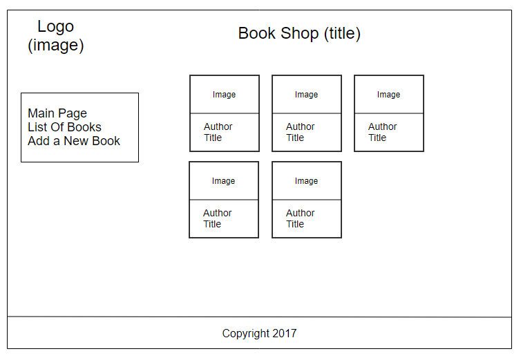

### Дизайн магазина

Создайте дизайн вашего магазина как показано на картинке:

Для общего расположения элементов используйте CSS Grid элемент.
Для списка меню и списка книг используйте Flexbox.

Примеры стилей для CSS Grid можно посмотреть здесь:
https://github.com/parkhomenko/frontend/tree/phase2/server/src/public
